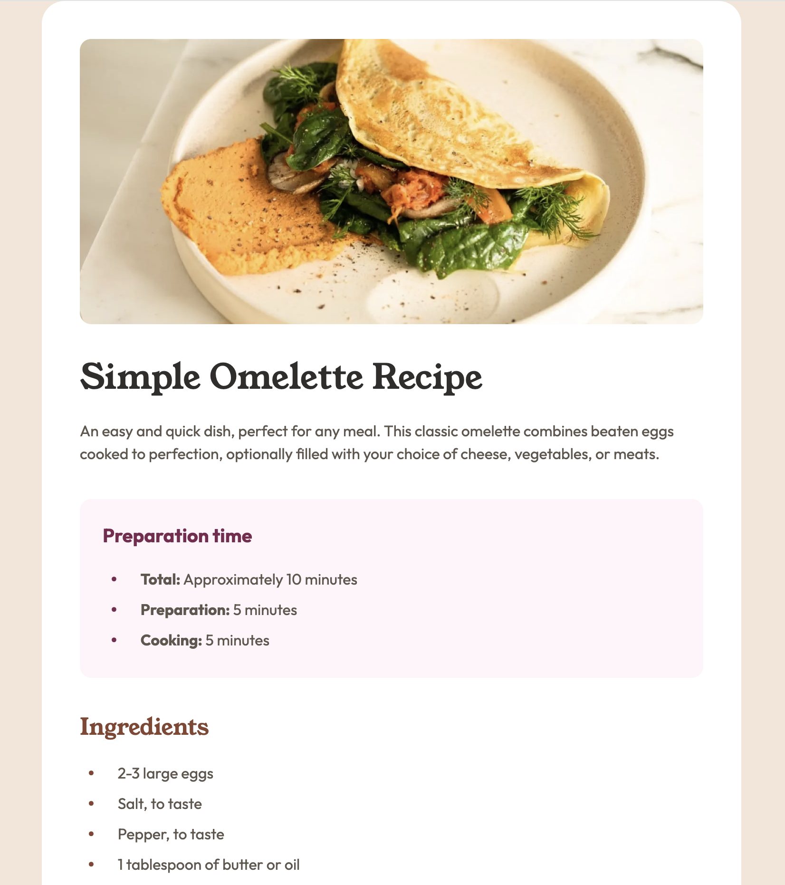

# Frontend Mentor - Recipe page solution

This is a solution to the [Recipe page challenge on Frontend Mentor](https://www.frontendmentor.io/challenges/recipe-page-KiTsR8QQKm). Frontend Mentor challenges help you improve your coding skills by building realistic projects.

## Table of contents

- [Overview](#overview)
  - [The challenge](#the-challenge)
  - [Screenshot](#screenshot)
  - [Links](#links)
- [My process](#my-process)
  - [Built with](#built-with)
  - [What I learned](#what-i-learned)
  - [Continued development](#continued-development)
  - [Useful resources](#useful-resources)
- [Author](#author)

## Overview

### Screenshot

### Links

- Solution URL: [fm-recipe-page-main](https://github.com/tmykkanen/fm-recipe-page-main)
- Live Site URL: [tlmfmrecipepage.netlify.app](https://tlmfmrecipepage.netlify.app/)

## My process

### Built with

- 
- 

### What I learned

- I used `::before` for more customized list styling combined with custom css counters for `<ol>`. I haven't used either of these features much before and I learned a lot by reading documentation and some articles on CSS Tricks.
- I did some more reading on semantic html and accessibility.
- I used container queries for the first time. I also used `grid` for layout, following Kevin Powell's really helpful youtube video.

### Continued development

- I'd like to continue learning container queries and `grid` positioning. They both seem quite powerful.

### Useful resources

- [Kevin Powell: A new approach to container and wrapper classes](https://www.youtube.com/watch?v=c13gpBrnGEw)
- [CSS Tricks: Styling Counters](https://css-tricks.com/styling-counters-in-css/)
- [MDN Semantics](https://developer.mozilla.org/en-US/docs/Glossary/Semantics)
- [ARIA Authoring Practices Guide](https://www.w3.org/WAI/ARIA/apg/patterns/)

## Author

- Github - [tmykkanen](https://github.com/tmykkanen)
- Frontend Mentor - [@tmykkanen](https://www.frontendmentor.io/profile/tmykkanen)
